# AMD Radeon:tm: ProRender SDK Tutorials

List of tutorials in this SDK

| Model                                                      | Screenshot                                          | Description |
|------------------------------------------------------------|-----------------------------------------------------|-------------|
| [Context Creation](00_context_creation)                    | 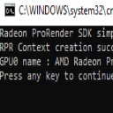             | This demo shows how to create a RPR context. The RPR context is the first object that needs to be created before any RPR renderings. |
| [Parameters Enumeration](03_parameters_enumeration)        |        | This tutorials illustrates how to use getters of the RPR API to get current states/values of different objects. |
| [Basic Scene](05_basic_scene)                              | 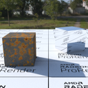                  | This demo is a good starting point to learn all the basic features of RPR. You'll learn how to manage  geometry, light, camera, framebuffer, materials for simple cubes renderings. |
| [Deformation Motion Blur](13_deformation_motion_blur)      | 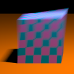      | This demo covers vertices deformation over time for a blur effect. |
| [Material](21_material)                                    | 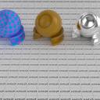                     | This demo illustrates how to create materials in RPR. It's not covering the UBER material which is used inside the 22_material_uber demo. |
| [Uber Material](22_material_uber)                          | 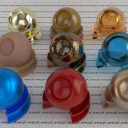                | This demo illustrates examples for the UBER ( RPR_MATERIAL_NODE_UBERV2 ) material.  |
| [Two Sided materials](23_twosided)                         | 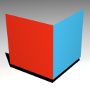                     | This demo illustrates how to define different materials on the front and back face of mesh faces.  |
| [Tiled Render](30_tiled_render)                            | 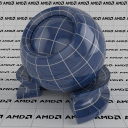                 | This demo illustrates how to break down the framebuffer into smaller render regions (tiles) |
| [Framebuffer access](31_framebuffer_access)                | 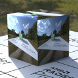           | Here we demonstrate usage of rprFrameBufferGetInfo: We can access the image data of a frame buffer. In this demo, we use the data of a first rendering and use it as an input texture for a second rendering. |
| [OpenGL interop](32_gl_interop)                            | 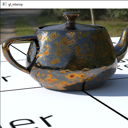                   | Demo covering an RPR rendering inside an OpenGL app. |
| [AOVs](33_aov)                                             | 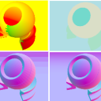                          | This demo covers AOV (Arbitrary Output Variables), providing way to render different material component - mostly used for scene debugging. |
| [Curves](50_curve)                                         | 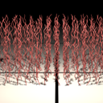                        | Demo covering Curves rendering. Curves are often used for hair rendering. |
| [Volume](51_volume)                                        | 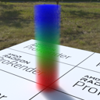                       | This demo demonstrates Volumes with RPR |
| [RPR Scene Export](60_mesh_export)                         |                   | Shows how to export an RPR scene as RPRS files ( native RPR file format ) or GLTF ( Khronos Group ). |
| [RPR Scene Import](61_mesh_import)                         | 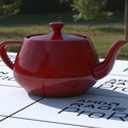                  | Shows how to import an RPR scene as RPRS files ( native RPR file format ) or GLTF ( Khronos Group ). It's advised to execute the demo "60_mesh_export" first in order to create the files used in this "61_mesh_import" Demo. |
| [Hybrid](63_hybrid)                                        | 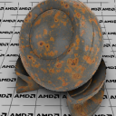                       | This is a demo for the Hybrid.DLL plugin. |
| [Mesh OBJ Demo](64_mesh_obj_demo)                          | 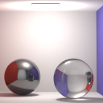                | Project that import and rendering any OBJ file with Radeon ProRender. |

